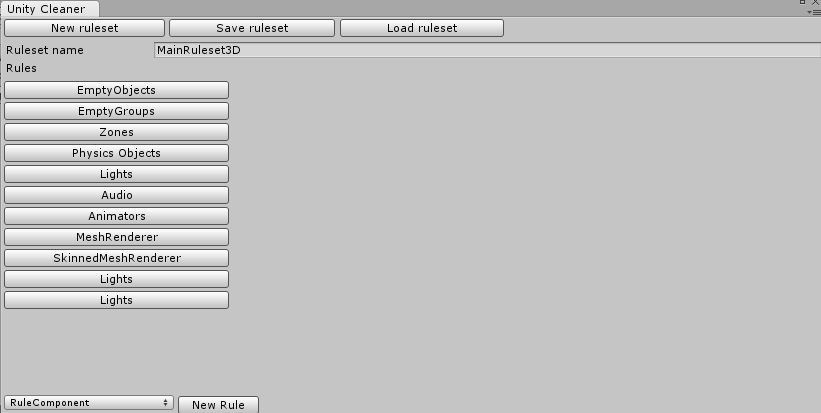
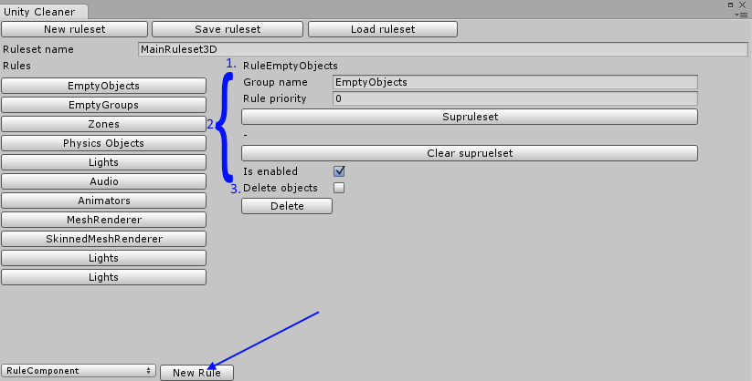

# Cleaner Manager

The main window for editing rulesets, it can be opened through `Tools/Scene Cleaner Pro/Cleaner manager`

## Edit and create rulesets

This is the default look of the manager when it is opened. To open a ruleset click the Load ruleset button, then we can choose a saved ruleset to load in to the manager.

Once we have a ruleset loaded, we can see the rules it contains, and what each rule has been set to do.

1. The type of rule
2. The general properties for the rule
3. The special properties for the given type of rule

And at the bottom we can create a new rule of a chosen type.

Once we are done editing the ruleset we can save it by simply clicking the Save ruleset button. (by default valid rulesets will be saved when the window is closed) Once a ruleset is saved it can be used to clean the hierarchy or as a sup-ruleset to another ruleset.

## The rules

Each rule used in Scene Cleaner Pro has some general properties, no matter if it’s a stock rule or user created, the properties are as follows:

Delete: deletes the rule from the ruleset.

Group name: the name of the object all applicable objects will be placed under.

Rule priority: the order which the rules are run, lower priority numbers run be higher once.

Sup-ruleset: sup-ruleset is a second ruleset that is run on all objects within the group created by the rule.

Is Enabled: determines if the rule should be used when cleaning or not

## The stock rules

Scene Cleaner Pro comes stocked with four different rules:

RuleComponent: cleans based on components in objects.

RuleEmptyObjects: cleans all objects with no children and no components other than transform, option to delete these objects or simply group them up.

RuleNamePrefix: cleans based on a set prefix on object names.

RuleTag: cleans based on object tags.