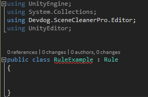
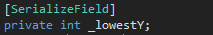
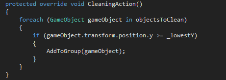

# Make your own rules

If some form of rule that you need is not provided by Scene Cleaner Pro by default you can easily make it yourself!

Making your own rule is easy:

1. Make a new script in an editor folder in your project
2. Use the **Devdog.SceneCleanerPro.Editor** namespace
3. Use the **UnityEditor** namespace
4. Set your rule to inherit from **Rule**

You should now have something that looks like this:

Now you have to implement the **abstract methods**, **CleaningAction()** and **DrawingAction()**, and if needed in your case **OnLoad()**

Now it is time to make the rule do something, in this example we are going to just make the rule clean every object that has a **Y** position over a set **Y**.

To accomplish this we need to first add a field for the **Y** value we want to check against, and make sure that if you want a field to be saved that you make it **[SerializeField]**.

Now we have to make the UI for the rule, we do this using **EditorGUILayout**, in this example we need an **IntField**.

The rule UI will now look like this:

Where the bottom line right above the **Delete** button is for this rule specifically.

Now all that remains is to add the cleaning behavior in **CleaningAction()**, to do this we need to run a loop on **objectsToClean** which is a property from the **Rule** base class.

In this loop we have to check if the object fits our set criteria, and if it does call the method **AddToGroup(GameObject objectToAdd)** and use the object that fit the criteria as the parameter.

Now the rule is done and ready to be used.